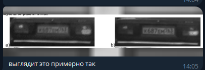

# Повышение качества изображений по серии кадров для задач криминалистической экспертизы

Собрать воспроизводимый пайплайн:

вход: N кадров (низкое разрешение/шум)
этап A: новый «нейросетевой интерполятор» (замена этапа 1)
этап B: геометрическое согласование (можно оставить как в диссертации)
этап C: комплексирование по весам (оставить, но заменить источник “ошибок”)

Для задач криминалистической экспертизы критически важна верифицируемость и математическая обоснованность восстановленных деталей. По этой причине из рассмотрения исключаются генеративные подходы (GAN, диффузионные модели), способные синтезировать реалистичные, но не соответствующие истинным деталям изображения. В исследовании используются только восстанавливающие модели, оптимизирующие критерий точности (PSNR/MSE).

---

В дисере был алгоритм,у которого было 3 этапа:
1. интерполяция (чисто методами ЦОСа, с четырехэтажными дробями) изображения с вычислением ошибок в каждом пикселе
2. геометрическое согласование
3. комплексирование с учетом ошибок интерполяции, полученных на 1 этапе

В итоге по серии кадров получался один кадр качеством получше

Тема для нирс и диплома - замена этапа 1 на нейронку
Нейронок для sisr в открытом доступе полно, даже предобученных. Осталось придумать, как оценивать ошибку в каждой точке изображения после обработки нейросетью. Это можно делать либо каким-то максимально тупым эмпирическим образом, либо написать и обучить какой-нибудь простенький триплет.

---
текст диссера: 
- В разделе 1 дано общее описание метода
- Раздел 2 точно можешь не читать
- В разделе 3 приведены алгоритмы для геометрического согласования, они фактически собраны из opencv, pystackreg, image_registration, imreg_dft, scikit-image
- В разделе 4 описан алгоритм комплексирования, он в репозитории, по-моему, более-менее вменяемо реализован
- sisr методы придется поискать самостоятельно, диссеру 3 года, так что источники там устарели

---
Кстати напоминаю, что трансформации при геометрическом согласовании применяются и к полю ошибок тоже. Ну и комплексирование тоже происходит с учетом их значений.

