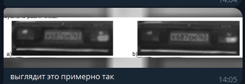

# ! Заполнение данного документа идет сверху вниз !

1. Этап SISR
Для каждого кадра улучшаем в 2 раза разрешение 
1. Берем shape из 1 кадра уже улучшенного к примеру у было 800x600 стало 1600x1200
2. остальные кадры должны быть по разрешению такими же как и 1 кадр 
    2.1 если они по разрешению получились больше чем 1600x1200 мы их кропим до 1600x1200
    2.2 если они по разрешению получились меньше чем 1600x1200 мы дополняеем прочто черными или белыми пикселями 

2. Этап геометрическое согласование 
   

19.11.2025
[] Основной план вроде такой:  
1. зафиксировать объект на серии кадров 
2. Провести интерполяцию (сделать разрешение выше) 
    2.1 Попутно сохраняем поля ошибок интерполяции отсчетов. Сохраняем как .npy рядом с изображением $"{img}_err.npy".
3. Геометрически согласовываем определнный объект на наших изображениях/ При этом трансформируем и сами интерполированные изображения
4. Комплексирование восстановленных и геометрически согласованных кадров(это я пока не особо вдуплил как работает) но этот этап из серии кадров делает одно качественное и разборчивое изображение
5. Конец 

==============================================================

В дисере был алгоритм,у которого было 3 этапа:
1. интерполяция (чисто методами ЦОСа, с четырехэтажными дробями) изображения с вычислением ошибок в каждом пикселе
2. геометрическое согласование
3. комплексирование с учетом ошибок интерполяции, полученных на 1 этапе

В итоге по серии кадров получался один кадр качеством получше

Тема для нирс и диплома - замена этапа 1 на нейронку
Нейронок для sisr в открытом доступе полно, даже предобученных. Осталось придумать, как оценивать ошибку в каждой точке изображения после обработки нейросетью. Это можно делать либо каким-то максимально тупым эмпирическим образом, либо написать и обучить какой-нибудь простенький триплет.

Код дипломника прошлых лет лежит вот [тут](https://github.com/alxmcs/MultipleImageSuperresolution)
До этапа написания нейронки он не добрался 
Так что предлагаю начать со знакомства с областью исследований и рефакторинга, которое находится в этом репозитории
человек рожал на протяжении полутора лет (получилось так себе)

текст диссера: 
- В разделе 1 дано общее описание метода
- Раздел 2 точно можешь не читать
- В разделе 3 приведены алгоритмы для геометрического согласования, они фактически собраны из opencv, pystackreg, image_registration, imreg_dft, scikit-image
- В разделе 4 описан алгоритм комплексирования, он в репозитории, по-моему, более-менее вменяемо реализован
- sisr методы придется поискать самостоятельно, диссеру 3 года, так что источники там устарели

Моя ближайшая задача:
1. прочитать диссер 
2. реализовать (если не хочешь брать чужой код) геометрическое согласование и комплексирование. Оба эти этапа должны помимо картинок, юзать еще и поля ошибок.  
3. Поля ошибок в тексте диссера описаны как дополнительный канал изображения. Так выдрачиваться не надо, просто считай это отдельным нампай массивом, а храни как .npy рядом с картинкой.

Кстати напоминаю, что трансформации при геометрическом согласовании применяются и к полю ошибок тоже. Ну и комплексирование тоже происходит с учетом их значений.

*диплом предлагает какую-то научную новизну, нужно будет поторговать лицом на какой-нибудь научной конференции. Хотя бы на студенческой. Потому что комиссия на защите к научным дипломам без апробации относится с подозрением
